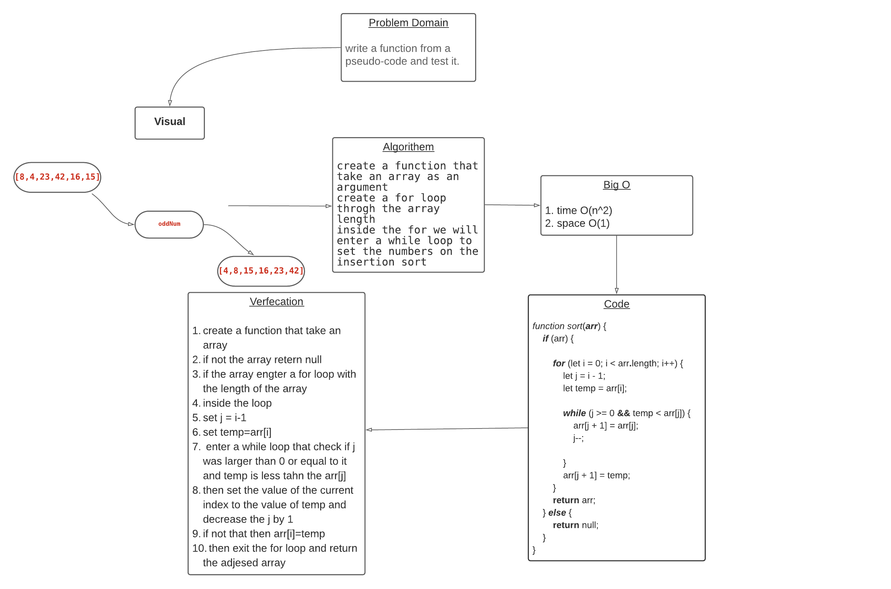

# Selection Sort

**Selection Sort** is a sorting algorithm that traverses the array multiple times as it slowly builds out the sorting sequence. The traversal keeps track of the minimum value and places it in the front of the array which should be incrementally sorted.

_____________________________
# Challenge

* provide a visual step through the code 
* build a function from the pseudo-code
* test the function 
_______________________________

# White board:
* [code](https://github.com/BayanAbualhaj/data-structures-and-algorithms/blob/master/401challenges/insertionSort/sort.js)

