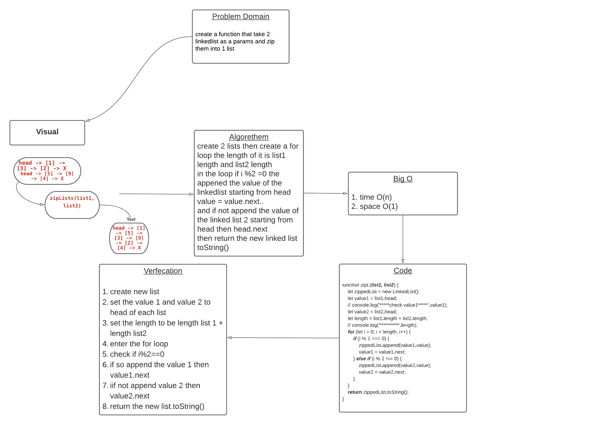

# Zip-ll
we need to create a function to zip two linked list 

## challenge 
1. create 2 linked lists
2. create a function take them as a parameter 
3. make them as 1 linked list 

## Approach & Efficiency
* Big O time : O(n^2)
* Big O space: O(1)

## solution 

;