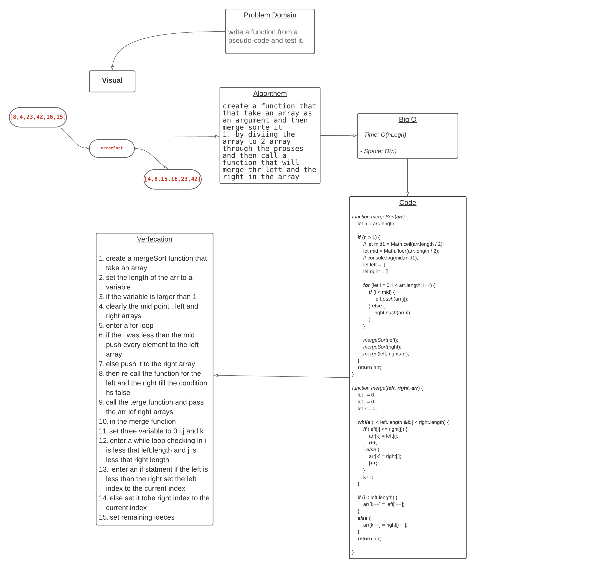

# Challenge Summary
Review the pseudocode below, then trace the algorithm by stepping through the process with the provided sample array.

[8,4,23,42,16,15]

## Challenge Description
* Provide a visual step through for each of the sample arrays based on the provided pseudo code
* Convert the pseudo-code into working code in your language
* Present a complete set of working tests

## Approach & Efficiency

- Time: O(nLogn)

- Space: O(n)

## Solution

* [code]()

