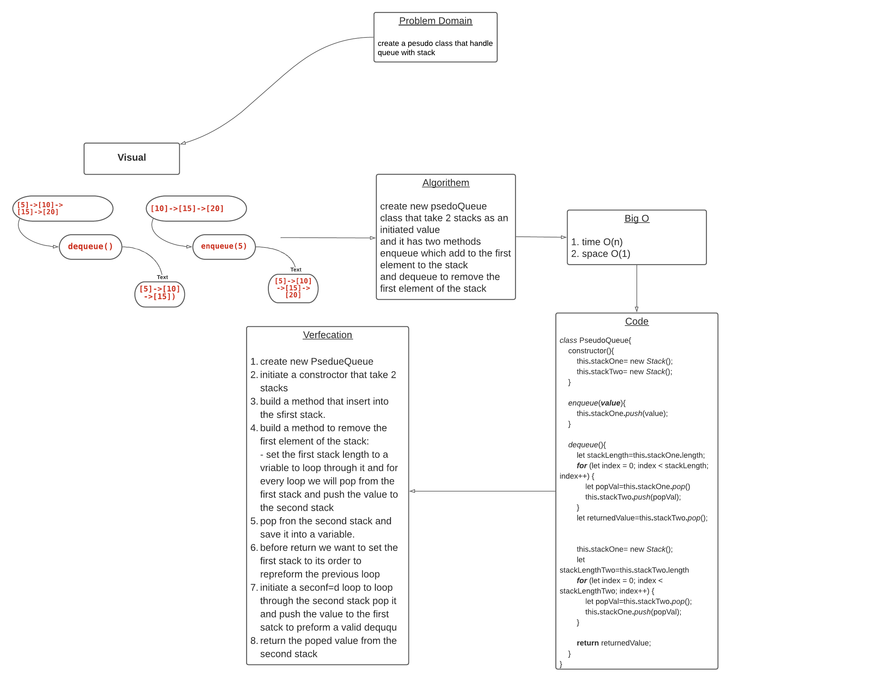

# queue-with-stacks

the challenge is to handle a stack with a queue 

1. to build a pseudoQueue that take a 2 stacks
2. to build two methods :
    - enqueue
    - dequeue
3. implement a task unit with happy path,expected fail and edge case 
4. draw a white board 

* [hereIsTheCode]()

_________________

