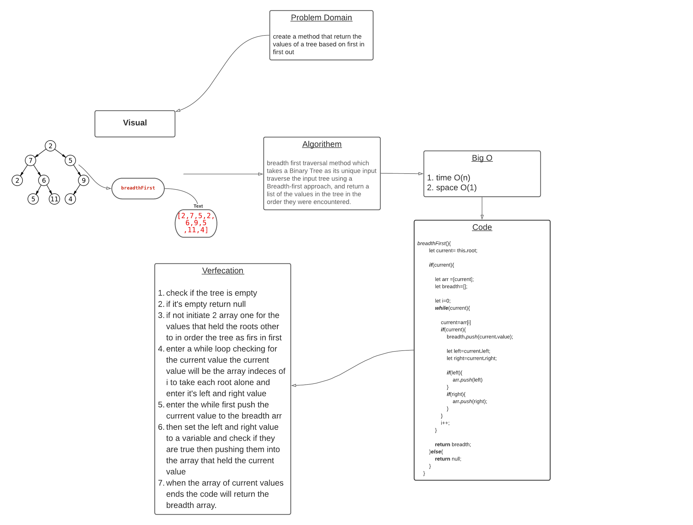

## Challenge Summary
breadth first traversal method which takes a Binary Tree,traverse the tree using a Breadth-first approach, and return a list of the values in the tree in the order they were encountered.

## Approach & Efficiency

* big O of: 
    - time O(n)
    - space O(1)

## Solution
* [code](https://github.com/BayanAbualhaj/data-structures-and-algorithms/blob/master/401challenges/tree/tree.js)

* WhiteBoard:

