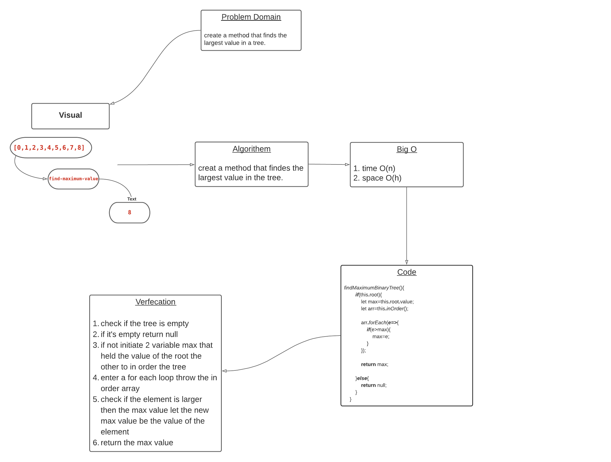

## Challenge Summary
instance method called find-maximum-value return the maximum value stored in the tree. You can assume that the values stored in the Binary Tree will be numeric.

## Approach & Efficiency

* big O of: 
    - time O(n)
    - space O(h)

## Solution
* [code](https://github.com/BayanAbualhaj/data-structures-and-algorithms/blob/master/401challenges/tree/tree.js)

* WhiteBoard:

