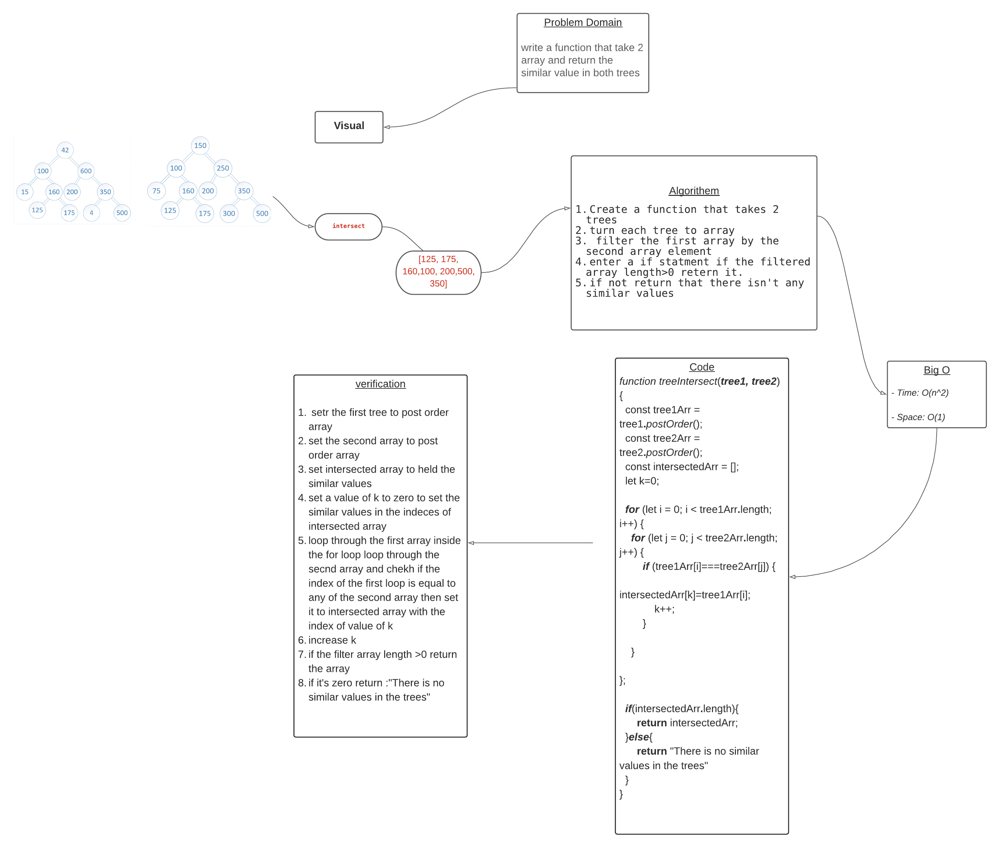

# Challenge Summary

* Write a function called tree_intersection that takes two binary tree parameters.
* Without utilizing any of the built-in library methods available to your language, return a set of values found in both trees.

## Approach & Efficiency
* Time : O(n^2)
* Space:O(1)

## Solution
* [code](https://github.com/BayanAbualhaj/data-structures-and-algorithms/blob/master/401challenges/treeIntersection/treeIntersection.js)

